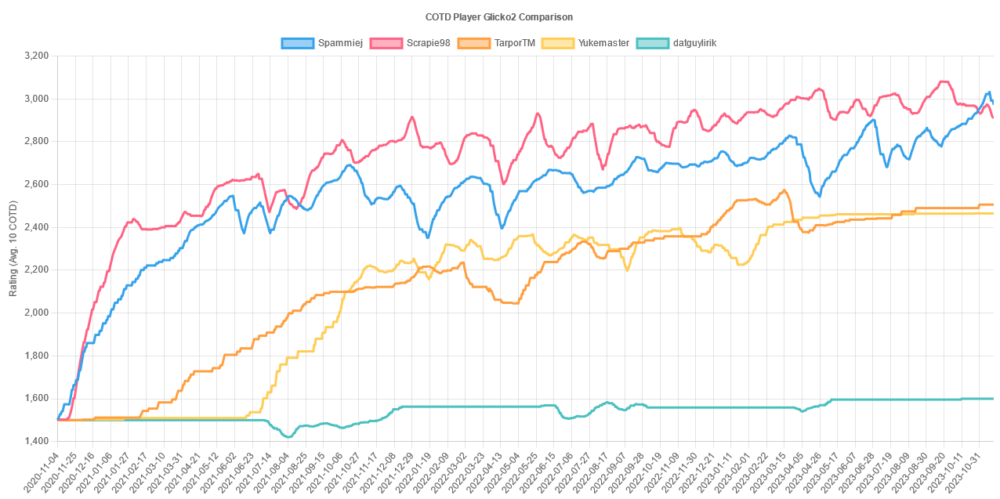

# COTD Rank

The goal of this project was to check if it would be possible to implement a player rating system for the game **Trackmania** from Nadeo Ubisoft and their "game mode" COTD.

## Game Mode

The cup of the day (COTD) is a daily event where:

1. Qualification: Players play a time attack mode on a new map (the map is unknown to the players) for 15 minutes, trying to achieve their best possible time
2. After 15 minutes, players get placed in divisions/matches of 64 players (division/match 1 = top 64 players, division/match 2 = top 65 - 128 player, ...) based on their performance during the time attack
3. Rounds: After the qualification, players play in their division of 64 players, where every round a certain amount of players get eliminated (slowest 4, then slowest 2, then slowest) until only the last player remains
4. The last player remaining is the winner of their division.

This free for all (FFA) tournament takes place every day at 7pm CET/CEST. This tournament is repeated on the same map at 1am CET/CEST (the next day) and 7am CET/CEST allowing players in other time zones to also enjoy this game mode. However, these tournaments are considered less prestigious since now the map is known, the amount of players is significantly lower, and generally speaking, the more skilled players often only play the first edition (Trackmania is heavily focused on EU time zones).

> If you want to create a rating/ranking it is recommended to only focus on the first COTD event/tournament played at 7pm CET/CEST.

## Maps

The maps used in this daily event/tournament can be **very** different from each other, since Trackmania allows different track surfaces and track styles. This means players can be good on one map style but bad on another map style. However, the best players still manage to get into division 1 or at least division 2, despite the widely different map styles.

## Special events

The first of every month is played on a fun map (also called troll COTD). This can be a map with fun elements (e.g. moving elements on the track) or, very often "random" maps where it's considered random if you get a good time or not. 

> If you want to create a purely skill based rating/ranking it would be recommended to ignore maps played on the first of the month.

## Crossplay

At some point Trackmania also became available for various consoles/handheld devices. On such devices it's possible to disable crossplay. This places players with such settings in a separate COTD environment where they only play against players with the same device. This setting is only used by very few players.

> If you want to create a rating/ranking it is recommended to ignore such environments and only focus on the general case where players have enabled crossplay

## Rating challenges

1. Players have different skill levels based on map style, and it's not possible to reliably get the map style from any database -> a rating per map style is very difficult to generate -> ratings are more volatile than e.g. in chess or CounterStrike, Dota2 etc.
2. A player may choose not to participate in the COTD if they realize they are not getting placed in a good division
3. A player may only participate in COTD events/tournaments that feature the map style they are good at
4. A naive FFA ELO/glicko rating would result in very volatile ratings, considering it's very realistic for players to become top 10 in one COTD but only top 64 in the next COTD.
5. A player in division 2 (e.g. winner of division 2 has effectively the position 65 in a global ranking) is automatically considered worse than the last place in one division higher (e.g. place 64 in division 1) without directly playing against each other. However, in reality it's very likely that the winner of division 2 would have actually won against place 64 in division 1.

## Rating

We performed the following rating algorithm:

1. ELO/Glicko/Glicko2
2. For visualization, we averaged the ELO of the last 10 COTD ratings (that is the 10 last played COTD by that player, not the 10 last days)
3. Calculate the rating by letting every player in a COTD play against every other player (e.g. global place 64 one against global place 65 etc.)
4. Divide the calculated rating gain/loss by 10 to limit the gain/loss by 1/10-th. This leads to a more realistic gain/loss per COTD of 10 - 70 rating points.
5. Set a maximum rating gain/loss of 300 per COTD (usually only relevant for the first 10 COTD matches)
6. Limit the minimum ELO a player can have to 100.
7. A player who participated in the time attack/qualification but not in the COTD is ignored on that day.

### Result

1. As a subjective feeling, this already gets the rating 90% of the way to where it should be. The results make mostly sense, apart from maybe some minor inconsistencies.
2. The ratings were tested for the top players and the mid-level players, but not for low- or very-low rated players.

### Improvements

1. Exclude the troll COTD at the beginning of every month
2. Reduce the K-Factor for ELO calculation from 32 to 10
3. Adjust the general rating factor from 1/10-th to 1/5-th.
4. Test TrueSkill (not yet tested)
5. If a player participated in the time attack/qualification but not in the COTD the player should be automatically rated with position 64 in their respective division in order to discurage players from rating manipulation through not participating if they are not happy with their division placement. (remark: However, it's still possible to game the system by leaving the time attack/qualification before it finishes. In such a case the game servers think the player didn't play at all even if the player finished a time during the time attack/qualification. In short, leaving the time attack/qualification before it concludes basically deletes all times of that player. This could be of course abused by the player if an official rating system ever gets implemented. For retrospective rating calculations this scenario shouldn't matter).
6. For the frist X games (e.g. 5) set the general rating factor from 1/5-th to 1. This would allow players to reach their "true" rating much quicker.

## Remark

Since the Trackmania API (https://webservices.openplanet.dev/) is open (after creating a ubisoft+nadeo account) and the game mode is different from many other games (small team games, 1v1, ...) this provides an interesting field and opportunity to study and experiment with. If you are interested in mathematics and/or rating systems I recommend playing around with different rating scenarios in Trackmania.

## Image

